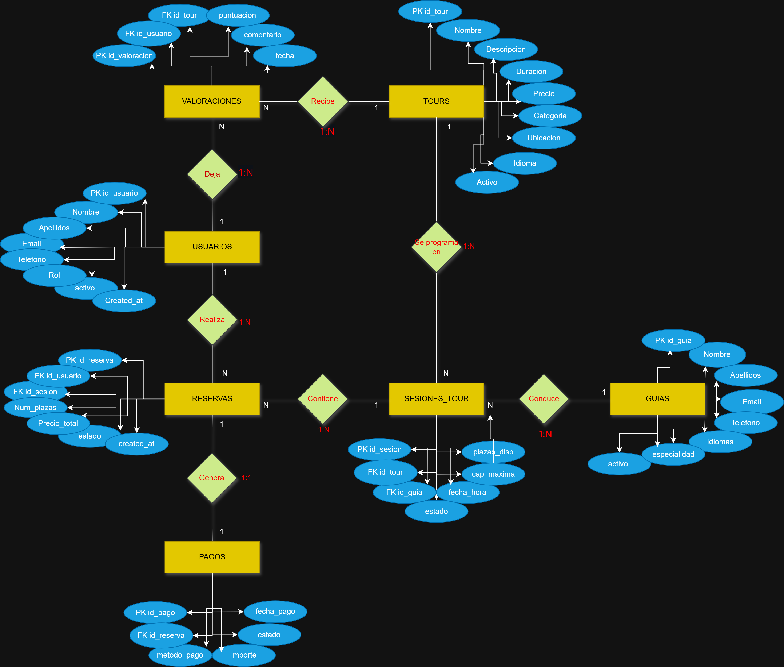

# 02 — Diagrama Entidad–Relación

## The Santy's Tours — Gestión de Bases de Datos

---

## Diagrama E/R

---

## Descripción de relaciones

| Entidad A | Relación | Entidad B | Cardinalidad |
|---|---|---|---|
| USUARIOS | Deja | VALORACIONES | 1:N |
| TOURS | Recibe | VALORACIONES | 1:N |
| USUARIOS | Realiza | RESERVAS | 1:N |
| TOURS | Se programa en | SESIONES_TOUR | 1:N |
| GUIAS | Conduce | SESIONES_TOUR | 1:N |
| SESIONES_TOUR | Contiene | RESERVAS | 1:N |
| RESERVAS | Genera | PAGOS | 1:1 |

---

## Descripción detallada de cada relación

### USUARIOS — Deja — VALORACIONES (1:N)
Un usuario puede dejar valoraciones en múltiples tours, siempre que los haya completado. Cada valoración pertenece a un único usuario.

### TOURS — Recibe — VALORACIONES (1:N)
Un tour puede acumular múltiples valoraciones de distintos clientes. Cada valoración hace referencia a un único tour.

### USUARIOS — Realiza — RESERVAS (1:N)
Un usuario puede realizar múltiples reservas a lo largo del tiempo. Cada reserva pertenece a un único usuario.

### TOURS — Se programa en — SESIONES_TOUR (1:N)
Un tour del catálogo puede programarse en múltiples sesiones con distintas fechas, horas y guías. Cada sesión pertenece a un único tour.

### GUIAS — Conduce — SESIONES_TOUR (1:N)
Un guía puede ser asignado a múltiples sesiones. Cada sesión tiene un guía principal asignado.

### SESIONES_TOUR — Contiene — RESERVAS (1:N)
Una sesión puede tener múltiples reservas hasta cubrir su capacidad máxima. Cada reserva está ligada a una única sesión.

### RESERVAS — Genera — PAGOS (1:1)
Cada reserva genera exactamente un registro de pago. La relación 1:1 está garantizada por el `UNIQUE` en `pagos.id_reserva`.

---

## Restricciones de integridad destacadas

- Un cliente solo puede valorar un tour si tiene una reserva en estado `completada` para ese tour.
- Las plazas disponibles de una sesión no pueden ser negativas ni superar la capacidad máxima.
- El precio total de una reserva debe coincidir con `num_plazas × precio_persona` del tour.
- No pueden existir dos valoraciones del mismo usuario para el mismo tour (`UNIQUE(id_usuario, id_tour)`).
- Cada reserva tiene exactamente un pago asociado (`UNIQUE(id_reserva)` en la tabla `pagos`).
