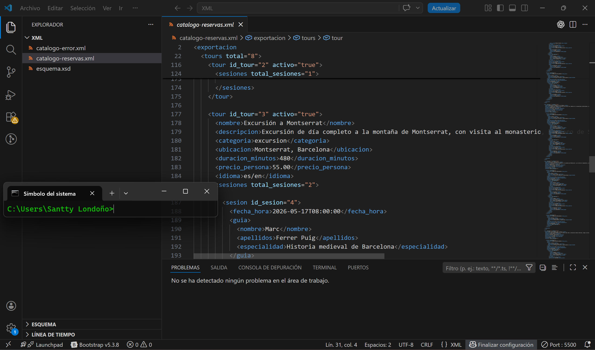
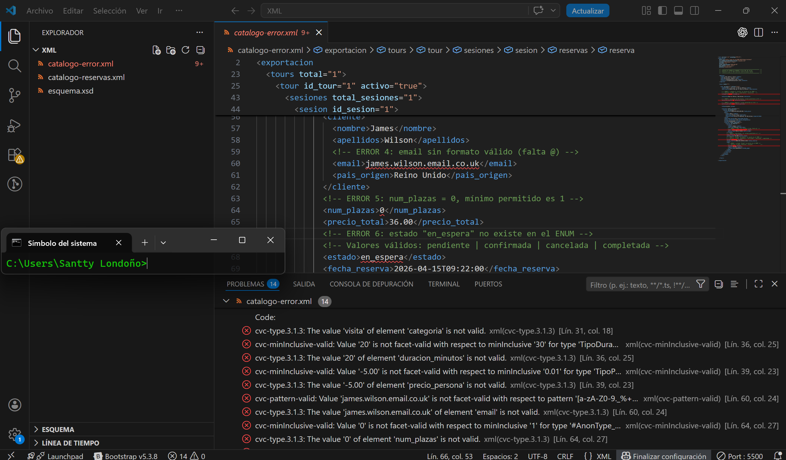

# Evidencia de Validación — LMSGI

**Proyecto:** The Santy's Tours  
**Módulo:** Lenguajes de Marcas y Sistemas de Gestión de Información (0373)  
**Herramienta:** VS Code con extensión XML de Red Hat  
**Fecha:** 2026-04-26

---

## 1. Validación correcta — `catalogo-reservas.xml`

El archivo `catalogo-reservas.xml` se valida contra `esquema.xsd` sin ningún error ni warning.

**Resultado:** Panel Problemas vacío — *"No se ha detectado ningún problema en el área de trabajo."*  
**Barra inferior:** ⊗ 0 errores · △ 0 warnings ✅

---

## 2. Validación fallida — `catalogo-error.xml`

El archivo `catalogo-error.xml` contiene **7 errores intencionados** que el XSD detecta y rechaza correctamente.

**Resultado:** Panel Problemas con **14 entradas** en rojo ❌

### Errores detectados por el XSD

| # | Elemento | Error introducido | Restricción XSD violada |
|---|----------|-------------------|------------------------|
| 1 | `<categoria>` | Valor `visita` (no existe) | `enumeration`: tour \| experiencia \| excursion |
| 2 | `<duracion_minutos>` | Valor `20` (demasiado corto) | `minInclusive`: 30 minutos |
| 3 | `<precio_persona>` | Valor `-5.00` (negativo) | `minInclusive`: 0.01 |
| 4 | `<email>` | Sin `@` en la dirección | `pattern`: regex de email |
| 5 | `<num_plazas>` | Valor `0` (no puede ser cero) | `minInclusive`: 1 |
| 6 | `<estado>` reserva | Valor `en_espera` (no existe) | `enumeration`: pendiente \| confirmada \| cancelada \| completada |
| 7 | `<metodo>` pago | Valor `bizum` (no permitido) | `enumeration`: efectivo \| tarjeta |

---

## 3. Conclusión

El XSD no es decorativo: **detecta y rechaza datos incorrectos** señalando la línea exacta del problema y la restricción violada. Esto garantiza la integridad de los datos exportados desde `santys_tours` hacia cualquier sistema externo que consuma el XML.
